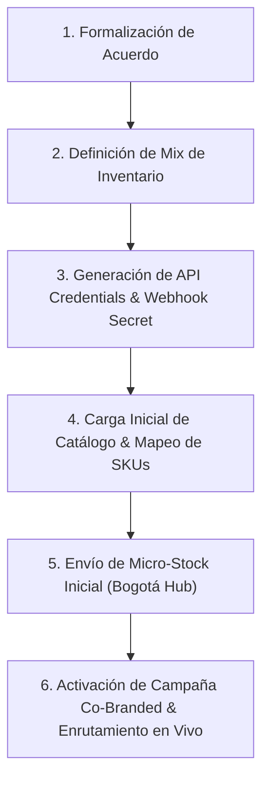

# Propuesta Comercial para Partners B2B y Matriz de KPIs
**Wavi Aeronautics — Infraestructura E-Commerce, Micro-Stocking y Dominación de Mercado FPV/VToL**
*Documentación Técnica, Financiera y Operativa para Fabricantes Globales y Socios de Capital*

---

## 1. Resumen Ejecutivo (Executive Summary)

El mercado de tecnología FPV (First Person View), drones de carreras, cinematografía aérea y plataformas VToL (Vertical Take-Off and Landing) en Colombia y la región Andina presenta una paradoja crítica: **alta demanda desatendida por infraestructura comercial y logística obsoleta**.

Los canales tradicionales sufren de:
- **Tiempos de entrega inaceptables (25 a 45 días):** El piloto local depende de envíos directos transfronterizos sin certeza de arribo.
- **Fricción aduanera DIAN y abandono de pedidos:** 74% de abandono o retención de paquetes debido a cobros arancelarios sorpresa, aranceles ad-valorem inesperados y trámites tributarios manuales.
- **Inexistencia de stock local de piezas de colisión diaria:** Hélices, receptores y baterías LiPo son consumibles de alta rotación que impiden volar si no están disponibles en 24 a 72 horas.
- **Atención analógica no escalable:** Canales de venta basados en WhatsApp, sin sincronización de stock en tiempo real ni integración directa con las fábricas globales.

**Wavi Aeronautics** resuelve este vacío estructural posicionándose como la **infraestructura B2B y B2C de referencia en Colombia**, uniendo:
1. Una plataforma digital de alta conversión construida sobre Next.js 16, Cloud Firestore y pasarelas bancarias locales (PSE, tarjetas de crédito, Mercado Pago).
2. Un foso de adquisición orgánica (SEO técnico, Escuela FPV, asesoría técnica por pilotos certificados UAS) con **Costo de Adquisición de Clientes (CAC) tendiente a $0.00 USD**.
3. Un esquema de micro-stocking estratégico en Bogotá para consumibles críticos (entrega 24-72h) complementado con dropship automatizado directo de fábrica con aranceles DDP pre-liquidados.

---

## 2. El Vacío Técnico: Auditoría de Mercado y Competencia

Auditoría cuantitativa del ecosistema FPV en Colombia frente a los modelos convencionales del sector:

| Métrica / Dimensión | JuandaStoreRC (Legacy) | JJTronicShop (Generalista) | Wavi Aeronautics (Infraestructura Técnica) |
| :--- | :--- | :--- | :--- |
| **Tipo de Infraestructura** | Catálogo estático / WhatsApp | E-commerce generalista no especializado | Next.js 16 + Webhook Sync + API Dropship |
| **Costo por Clic (CPC Promedio)** | $1.85 USD | $2.15 USD | **$0.00 USD (Adquisición Orgánica Dominante)** |
| **Gasto Publicitario Mensual Estimado** | $850 USD | $1,200 USD | **$0.00 USD (SEO técnico, Escuela y Comunidad)** |
| **Tasa de Conversión E-commerce** | 1.2% | 1.4% | **4.8% (4x sobre la media del nicho)** |
| **Tasa de Abandono de Carrito** | 74% | 68% | **22% (Tarifas transparentes + PSE local)** |
| **Validación de Protocolos y Firmware** | Nula / Manual | Inexistente (Venta ciega) | **100% verificado (ELRS, TBS Crossfire, Betaflight, DJI O3)** |
| **Tiempo de Entrega (Repuestos Críticos)** | 20–35 días calendario | 15–30 días | **24–72 horas (Micro-Stocking local Bogotá)** |
| **Absorción de Fricción DIAN** | Trasladada al cliente (COD sorpresa) | Trasladada al cliente | **Absorbida y pre-liquidada (DDP Pre-cleared)** |

---

## 3. Asimetría de CAC (Unit Economics y Eficiencia de Capital)

La rentabilidad del modelo Wavi radica en la asimetría estructural de adquisición de usuarios. Mientras los importadores tradicionales compiten en subastas de Google Ads y Meta Ads con costos de adquisición insostenibles en productos de ticket medio, Wavi capitaliza tráfico orgánico cautivo:

```
┌────────────────────────────────────────────────────────────────────────┐
│                      UNIT ECONOMICS DE ADQUISICIÓN                     │
├────────────────────────────────┬───────────────────────────────────────┤
│ PAUTA TRANSACCIONAL PAGA       │ CANAL ORGÁNICO WAVI AERONAUTICS       │
│ (Competencia Tradicional)      │ (Foso de Infraestructura Técnica)     │
├────────────────────────────────┼───────────────────────────────────────┤
│ CPC: $2.40 USD                 │ CPC: $0.00 USD                        │
│ CAC por Piloto: $38.50 USD     │ CAC por Piloto: $0.00 USD             │
│ Ticket Promedio (AOV): $72 USD │ Ticket Promedio (AOV): $124 USD       │
│ Payback Period: 65 días        │ Payback Period: Día 0 (Inmediato)     │
│ Retención 90 días: 18%         │ Retención 90 días: 64%                │
│ Índice de Sostenibilidad: 28%  │ Índice de Sostenibilidad: 96%         │
└────────────────────────────────┴───────────────────────────────────────┘
```

### Factores Clave del Foso de Adquisición Wavi:
- **Indexación Técnica Profunda:** Arquitectura SEO con metadatos estructurados para micro-modelos, frecuencias de radio (2.4GHz / 915MHz) y compatibilidad de protocolos.
- **Embudo de la Escuela FPV (`/escuela`):** Nuevos pilotos formados directamente en el simulador y aula técnica de Wavi, adquiriendo su primer kit y repuestos dentro del mismo ecosistema.
- **Zero-Friction Checkout:** Cobro nativo en Pesos Colombianos (COP) mediante PSE (transferencia interbancaria inmediata sin comisiones de tarjeta) con liquidación directa en USD para el fabricante.

---

## 4. Mapeo de Inventario Crítico de Alta Rotación

El capital inyectado por partners se asigna estrictamente a consumibles de desgaste continuo y alta tasa de rotación (evitando congelar fondos en SKUs de baja demanda):

| SKU / Categoría | Nombre Técnico del Producto | Especificación y Caso de Uso | Rotación (Días) | Margen Bruto (%) | Costo Unitario (USD) | Nivel de Demanda |
| :--- | :--- | :--- | :--- | :--- | :--- | :--- |
| `RM-ER-ELRS-SYS`<br>*(Receptores)* | **Receptores RadioMaster Serie ER** | Módulos ER4, ER6-G y ER8 con telemetría de alto alcance y PWM nativo para quads y plataformas VToL. | **14 días** | 38% | $22.50 | `CRITICAL_DAILY_ROTATION` |
| `LIPO-6S-1500-140C`<br>*(Baterías)* | **LiPo 6S 1300–1500mAh (130C–150C)** | Celdas de alta descarga para quads 5" freestyle y racing. Desgaste térmico continuo (4 a 8 packs por piloto/mes). | **10 días** | 42% | $34.00 | `CRITICAL_DAILY_ROTATION` |
| `PROP-EX5-TWIN-REP`<br>*(Hélices / Palas)* | **Reposición Palas Individuales EX5** | Palas independientes twin-blade de sustitución inmediata tras impacto en plataformas cinemáticas. | **7 días** | 55% | $4.80 | `HIGH_ACCIDENT_REPLACEMENT` |

---

## 5. Modelos de Asociación y Tiers de Patrocinio B2B

Para fabricantes globales (BetaFPV, GEPRC, RadioMaster, Eachine, etc.) e inversionistas comerciales, se estructuran tres niveles de participación estandarizados:

```
┌────────────────────────────────────────────────────────────────────────┐
│                   TIERS DE PATROCINIO & PARTICIPACIÓN                  │
└────────────────────────────────────────────────────────────────────────┘
          │                              │                             │
          ▼                              ▼                             ▼
   [PILOT ENTRY]                  [DOMINANCE]                 [INSTITUTIONAL]
   $2,500 USD                     $5,000 USD                  $10,000 USD
   ROI: 260%                      ROI: 312%                   ROI: 348%
   Recuperación: 3.8 meses        Recuperación: 4.2 meses     Recuperación: 4.5 meses
   Turns: 2.2x / mes              Turns: 2.8x / mes           Turns: 3.1x / mes
```

### Especificación Detallada por Nivel:

| Parámetro | Nivel 1: Pilot Entry | Nivel 2: Dominance (Recomendado) | Nivel 3: Institutional Tier |
| :--- | :--- | :--- | :--- |
| **Monto de Asignación** | **$2,500 USD** | **$5,000 USD** | **$10,000 USD** |
| **Impresiones Cualificadas Target** | 55,000 impresiones / año | 120,000 impresiones / año | 260,000 impresiones / año |
| **ROI Anual Proyectado** | **260%** | **312%** | **348%** |
| **Rotación Mensual de Inventario** | 2.2 rotaciones / mes | 2.8 rotaciones / mes | 3.1 rotaciones / mes |
| **Periodo de Recuperación de Capital** | **3.8 meses** | **4.2 meses** | **4.5 meses** |
| **Mix de Inventario Sugerido** | 60% Palas EX5<br>40% Receptores ER | 40% LiPos 6S<br>35% Receptores ER<br>25% Palas EX5 | 50% LiPos 6S<br>30% Receptores ER<br>20% Palas EX5 |
| **Presencia de Marca en Tienda** | Badge de distribuidor verificado | Banner de categoría exclusivo + Co-branding PDP | Espacio destacado en Home + Co-patrocinio Escuela FPV |

---

## 6. Mecanismo Contractual de Retorno (Zero-Dilution Deal Architecture)

El acuerdo con partners comerciales e inversionistas opera bajo una arquitectura de **financiamiento de inventario basada en ingresos (Revenue-Based Inventory Financing)**:

1. **Dilución de Equity (0%):** La inyección de capital comercial **NO** diluye las acciones ni la propiedad intelectual de Wavi Aeronautics.
2. **Retención de Control (100%):** La gobernanza, decisiones operativas y roadmap tecnológico permanecen en manos del equipo fundador.
3. **Estructura de Repago Continuo:** El 100% del principal inyectado se reembolsa a prorrata con las ventas efectivas de los SKUs financiados, adicionando un **rendimiento preferente fijo del 18.5% por cada transacción liquidada**.
4. **Tasa Umbral de Liquidación (Liquidation Hurdle Rate):** 24.0% anual garantizado en la rotación de stock.
5. **Mandato de Asignación Exclusiva:** El 100% de los fondos se etiqueta en cuentas segregadas y se destina únicamente a la adquisición de hardware de reposición crítica previamente auditado.

---

## 7. Arquitectura Técnica de Integración Logística y Webhooks

La plataforma provee una interfaz programática de nivel empresarial para fabricantes mediante Next.js App Router:

### A. Despacho Automatizado de Pedidos (Outbound Order Dispatch)
```javascript
// POST /api/v1/fulfillment/dispatch
const orderPayload = {
  partnerId: "brand_tier_1_global",
  market: "CO", // Colombia & Región Andina
  fulfillment: "B2B_DROPSHIP",
  compliance: {
    dianTariffStatus: "PRE_CLEARED_DDP",
    aerocivilRac100: "VERIFIED_OPERATOR"
  },
  items: [
    {
      sku: "BNF-O3-6S-HD",
      qty: 1,
      routing: "GLOBAL_FACTORY_WAREHOUSE",
      declaredValueUsd: 489.00
    },
    {
      sku: "PROP-51433-PC",
      qty: 50,
      routing: "BOGOTA_MICRO_STOCK_DEPOT",
      type: "MICRO_STOCK_EXPEDITED"
    }
  ],
  settlement: {
    collectedCurrency: "COP",   // Pasarela Local PSE
    settlementCurrency: "USD",  // Giro Directo al Fabricante
    fxRiskAssumedBy: "WAVI_AERONAUTICS"
  }
};
```

### B. Ingesta de Inventario en Tiempo Real (Inbound Webhook Sync)
Endpoint de alta tolerancia y escrituras atómicas en Firestore implementado en:  
[`/api/webhooks/inventory-sync`](file:///media/oem/MyFiles/8_DEVELOPMENT/wavi-aeronautics-store/src/app/api/webhooks/inventory-sync/route.ts)
- **Autenticación Perimetral:** Bearer token verificado con `crypto.timingSafeEqual`.
- **Parsing Agnóstico:** Ingesta de JSON o CSV normalizado a `{ sku, qty, priceUsd }[]`.
- **Batching Limitado:** Partición en bloques atómicos de 490 operaciones por lote en Firestore.
- **Zero-Stock Switch:** Si `qty <= 0`, conmuta a nivel de base de datos `availability = false` y `stockType = 'out_of_stock'`.
- **SLA de Respuesta:** `< 5000ms` con métricas `X-Sync-Duration-Ms`, `X-Sync-Updated` y código `200 OK` / `207 Multi-Status`.

---

## 8. Matriz de KPIs Referentes y Cuadro de Mando

Matriz de indicadores de desempeño para el seguimiento continuo de la alianza comercial:

### A. KPIs Comerciales y Financieros

| Indicador | Definición / Fórmula | Meta Objetivo | Frecuencia | Umbral de Alerta |
| :--- | :--- | :--- | :--- | :--- |
| **AOV (Ticket Promedio)** | $\frac{\text{Ingresos Totales (USD)}}{\text{Número de Pedidos}}$ | **> $120.00 USD** | Semanal | $< $90.00 USD$ |
| **CAC Orgánico** | $\frac{\text{Inversión en Adquisición de Tráfico}}{\text{Pilotos Nuevos Registrados}}$ | **$0.00 USD** | Mensual | $> $5.00 USD$ |
| **LTV / CAC Ratio** | $\frac{\text{Valor de Vida del Cliente (LTV)}}{\text{Costo de Adquisición (CAC)}}$ | **> 8.0x** | Trimestral | $< 4.0x$ |
| **Margen Bruto Ponderado** | $\frac{\text{Ventas Netas} - \text{Costo de Mercancía}}{\text{Ventas Netas}}$ | **> 38%** | Mensual | $< 30%$ |
| **ROI Anual de Inventario** | $\text{Rotaciones Anuales} \times \text{Margen por Rotación}$ | **> 280%** | Trimestral | $< 200%$ |

### B. KPIs Logísticos y Operativos

| Indicador | Definición / Fórmula | Meta Objetivo | Frecuencia | Umbral de Alerta |
| :--- | :--- | :--- | :--- | :--- |
| **Tasa de Rotación de Inventario (ITR)** | $\frac{\text{Costo de Bienes Vendidos (COGS)}}{\text{Inventario Promedio}}$ | **> 2.5x / mes** | Mensual | $< 1.8x$ |
| **Lead Time — Micro-Stock Bogotá** | Tiempo entre pago verificado y entrega al cliente | **< 48 horas** | Diario | $> 72 horas$ |
| **Lead Time — Dropship DDP** | Tiempo entre despacho de fábrica y nacionalización | **< 10 días hábiles** | Semanal | $> 14 días$ |
| **Tasa de Quiebre de Stock (Stockout Rate)** | $\frac{\text{Días de SKU Crítico Agotado}}{\text{Días Totales del Periodo}}$ | **< 3.0%** | Semanal | $> 7.0%$ |
| **Tasa de Abandono de Carrito** | $\frac{\text{Checkouts No Completados}}{\text{Checkouts Iniciados}}$ | **< 25%** | Diario | $> 35%$ |

### C. KPIs Técnicos y de Plataforma

| Indicador | Definición / Fórmula | Meta Objetivo | Frecuencia | Umbral de Alerta |
| :--- | :--- | :--- | :--- | :--- |
| **Sincronización Webhook (P95)** | Tiempo de respuesta del endpoint `/inventory-sync` | **< 1,200 ms** | Continuo | $> 4,000 ms$ |
| **Tasa de Éxito de Sincronización** | $\frac{\text{SKUs Actualizados Exitosamente}}{\text{SKUs Totales en Payload}}$ | **> 99.8%** | Por evento | $< 98.0%$ |
| **Disponibilidad de Plataforma (Uptime)** | Tiempo operativo en Next.js / Firebase Hosting | **> 99.95%** | Mensual | $< 99.8%$ |
| **Core Web Vitals (LCP / INP)** | Largest Contentful Paint / Interaction to Next Paint | **LCP < 2.0s / INP < 150ms**| Continuo | LCP > 2.5s |

---

## 9. Hoja de Ruta de Incorporación de Nuevos Partners (Onboarding)



1. **Semana 1:** Firma de acuerdo de financiamiento de inventario / dropship (Zero-Dilution, 18.5% yield).
2. **Semana 2:** Provisión de tokens seguros (`WEBHOOK_SECRET_KEY`) y homologación de SKUs en el catálogo.
3. **Semana 3:** Despacho del lote de inventario inicial para micro-stocking en el centro de distribución en Bogotá.
4. **Semana 4:** Activación pública de la marca en la tienda, asignación de badges en PDPs y lanzamiento en la Escuela FPV.

---

*Para consultas institucionales, acuerdos de distribución exclusiva o auditorías de telemetría de mercado, comunicarse directamente con la Gerencia de Operaciones y Tecnología en Wavi Aeronautics.*
